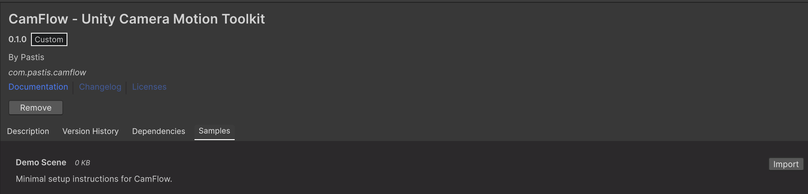
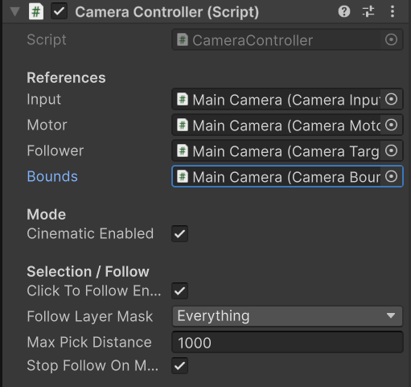
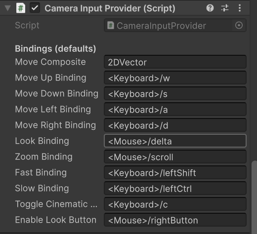
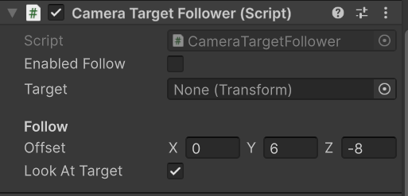
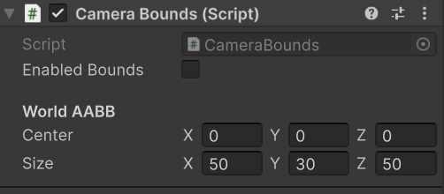

# Documentation CamFlow

**CamFlow** est un toolkit de caméra pour Unity conçu pour être modulaire, facile à intégrer et agréable à utiliser immédiatement. Il permet de gérer une caméra 3D avec des contrôles de style RTS/Free-Fly, un suivi de cible fluide et des limites de mouvement (bounds).

---

## Contenu du package (Package contents)

Le package contient les éléments suivants :
* **Runtime** : Scripts principaux (`CameraController`, `CameraMotor`, etc.).
* **Documentation~** : Ce fichier de documentation.
* **Samples~** : Scènes d'exemples prêtes à l'emploi.

---

## Instructions d'installation

Ce package s'installe via le Unity Package Manager (UPM).

<p align="center">
  
</p>

1. Ouvrez le **Package Manager** dans Unity (`Window > Package Manager`).
2. Cliquez sur le bouton **+** en haut à gauche.
3. Sélectionnez **"Add package from disk..."**.
4. Pointez vers le fichier `package.json` à la racine du dossier `com.pastis.camflow`.
5. *(Alternativement, si c'est un package git)* : Sélectionnez "Add package from git URL..." et entrez l'URL du dépôt.

---

## Prérequis (Requirements)

* **Unity Version** : 2021.3 ou supérieur recommandé.
* **Dépendance** : Ce package dépend de `com.unity.inputsystem`. Unity l'installera automatiquement s'il n'est pas présent.

---

## Limitations

* **2D** : Conçu pour la 3D, le système n'est pas optimisé pour les vues orthographiques 2D.
* **NavMesh** : Le système de limites (`CameraBounds`) utilise une simple boîte (AABB).

---

## Workflows (Démarrage Rapide)

Suivez ces étapes pour configurer la caméra :

### 1. Ajouter les composants à la main camera
- Sélectionnez `Main camera`.
- Ajoutez les composants `CameraController`, `CameraMotor`, `CameraInputProvider`, (optional)`CameraTargetFollower`.

<p align="center">
    
    <br>
    <em>Le composant principal CameraController</em>
</p>

| **Camera Motor** & **Input Provider** |
| :---: |
|   |

| **Target Follower** & **Camera Bounds** |
| :---: |
|   |

### 2. Configurer
- Sur `CameraMotor`, assurez-vous que `Target Camera` pointe bien vers `Main Camera`.
- Sur `CameraInputProvider`, les contrôles par défaut sont déjà actifs.

### 3. Jouer
Lancez la scène. Vous pouvez maintenant voler librement.

---

## Sujets Avancés (Advanced Topics)

### Scripting API
Vous pouvez piloter la caméra par code via le `CameraController`.

```csharp
// Récupérer le contrôleur
var camController = myRig.GetComponent<CameraController>();

// Définir une cible à suivre
camController.SetTarget(someTransform);

// Arrêter le suivi (passer null)
camController.SetTarget(null);

// Activer/Désactiver le mode cinématique
camController.SetCinematic(true);