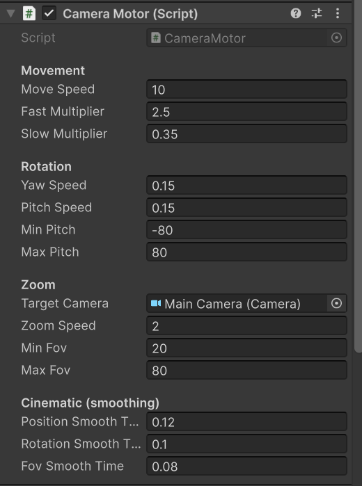

# Documentation CamFlow

**CamFlow** est un toolkit de caméra pour Unity conçu pour être modulaire, facile à intégrer et agréable à utiliser immédiatement. Il permet de gérer une caméra 3D avec des contrôles de style RTS/Free-Fly, un suivi de cible fluide et des limites de mouvement (bounds).

---

## Contenu du package (Package contents)

Le package contient les éléments suivants :
* **Runtime** : Scripts principaux (`CameraController`, `CameraMotor`, etc.).
* **Documentation~** : Ce fichier de documentation.
* **Samples~** : Scènes d'exemples prêtes à l'emploi.

---

## Instructions d'installation

Ce package s'installe via le Unity Package Manager (UPM).

<p align="center">
  
</p>

1. Ouvrez le **Package Manager** dans Unity (`Window > Package Manager`).
2. Cliquez sur le bouton **+** en haut à gauche.
3. Sélectionnez **"Add package from disk..."**.
4. Pointez vers le fichier `package.json` à la racine du dossier `com.pastis.camflow`.
5. *(Alternativement)* : Sélectionnez "Add package from git URL..." et entrez l'URL du dépôt.

---

## Prérequis (Requirements)

* **Unity Version** : 2021.3 ou supérieur recommandé.
* **Dépendance** : Ce package dépend de `com.unity.inputsystem`. Unity l'installera automatiquement s'il n'est pas présent.

---

## Limitations

* **2D** : Conçu pour la 3D, le système n'est pas optimisé pour les vues orthographiques 2D.
* **NavMesh** : Le système de limites (`CameraBounds`) utilise une simple boîte (AABB).

---

## Workflows (Démarrage Rapide)

Suivez ces étapes pour configurer la caméra :

### 1. Ajouter les composants à la main camera
- Sélectionnez `Main camera`.
- Ajoutez les composants `CameraController`, `CameraMotor`, `CameraInputProvider`, `CameraTargetFollower`.

<p align="center">
    
    <br>
    <em>Le composant principal CameraController</em>
</p>

|                                                      **Camera Motor** & **Input Provider**                                                       |
|:------------------------------------------------------------------------------------------------------------------------------------------------:|
|   |

| **Target Follower** |
| :---: |
| |

### 2. Configurer
- Sur `CameraMotor`, assurez-vous que `Target Camera` pointe bien vers `Main Camera`.
- Sur `CameraInputProvider`, les contrôles par défaut sont déjà actifs.
- (Optionnel) Sur un cube GameObject, désactiver le Mesh Renderer et ajouter `CameraBounds`, puis drag & drop le cube dans l'attribut `Bounds Root`

|                          **Camera Bounds**                          | 
|:-------------------------------------------------------------------:|
|  |

### 3. Contrôles

| Action | Entrée |
|------|------|
| Déplacement | W / A / S / D |
| Déplacement vertical | Q / E |
| Regarder | Clic droit (RMB) + souris |
| Zoom | Molette de la souris |
| Rapide / Lent | Shift / Ctrl |
| Activer / désactiver le mode cinématique | C |

---

## Suivi de cible (Target Following)

- Ajouter `CamFlowFollowable` à n’importe quel GameObject
- Cliquer gauche en mode Play pour suivre l’objet
- Appuyer sur une touche de déplacement pour arrêter le suivi
- Clic droit (RMB) + souris pour orbiter autour de la cible

---

## Limites de caméra (Camera Bounds)

- Ajouter `CameraBounds` à la Main Camera
- Configurer la source des limites :
    - Manuellement via les attributs : Entrer un centre puis les dimensions de la Bounding Box (AABB)
    - Via un Cube GameObject : Créer un Cube, désactiver le Mesh Renderer, ajouter le transform du Cube à l’attribut `Bounds Root` du composant `CameraBounds`
- La position de la caméra est contrainte après l’application du mouvement

---

## Suivi de groupe de cibles (Target Group Following)

CamFlow permet à la caméra de suivre **un groupe de cibles** plutôt qu’un seul objet.  
Ce mode est particulièrement utile pour des jeux de stratégie, des escouades, ou toute situation où plusieurs entités doivent rester visibles simultanément.

Contrairement au suivi classique, le suivi de groupe est **piloté uniquement via l’API** (pas de clic direct dans la scène pour le moment).

---

### CamFlowTargetGroup

Le composant `CamFlowTargetGroup` définit un groupe de cibles à suivre.

- Il contient une **liste dynamique de `Transform`**
- La caméra se positionne et s’oriente automatiquement pour que **toutes les cibles soient visibles dans le champ de vision**
- Les cibles peuvent être ajoutées ou retirées à l’exécution

#### Mise en place

1. Créer un GameObject vide dans la scène
2. Ajouter le composant `CamFlowTargetGroup`
3. Ajouter les `Transform` des objets à suivre dans la liste `Targets`

---

### Comportement de la caméra

Lorsque la caméra suit un `CamFlowTargetGroup` :

- Elle calcule un volume englobant toutes les cibles
- Elle s’oriente vers le centre du groupe
- Elle ajuste automatiquement sa distance (et/ou son cadrage) pour inclure toutes les cibles
- Le comportement est mis à jour en temps réel si les cibles se déplacent

Le suivi de groupe **prend le pas** sur :
- le free-fly
- le suivi d’une cible unique

---

### API – Activer / désactiver le suivi de groupe

Le suivi de groupe est contrôlé via le `CameraController`.

```csharp
using Pastis.CamFlow;

public class GroupCameraController : MonoBehaviour
{
    public CameraController cameraController;
    public CamFlowTargetGroup targetGroup;

    void Start()
    {
        // Activer le suivi du groupe
        cameraController.SetTargetGroup(targetGroup);
    }

    void StopFollowing()
    {
        // Désactiver le suivi du groupe (retour au free-fly)
        cameraController.ClearTargetGroup();
    }
}
```

### Intégration dans une scène de démo

Dans les scènes d’exemple, le suivi de groupe peut être activé via une interface utilisateur afin de démontrer son intégration dans un contexte réel.

- Un bouton UI déclenche l’appel à `SetTargetGroup(...)`
- Un second clic sur le même bouton appelle `ClearTargetGroup()`
- La caméra alterne ainsi dynamiquement entre :
  - un mode libre (free-fly)
  - un mode de suivi de groupe

Ce mécanisme permet de visualiser facilement le comportement du système et de tester le suivi de groupe sans modifier le code principal de la caméra.

---

### Notes et limitations

- Le suivi de groupe est actuellement **accessible uniquement via l’API**
- Il n’est pas possible de sélectionner un groupe par clic dans la scène
- Un seul groupe de cibles peut être suivi à la fois
- Le suivi de groupe est compatible avec :
  - le mode cinématique
  - les limites de déplacement (`CameraBounds`)

---

### Cas d’usage typiques

- Suivi d’une escouade ou d’un groupe d’unités
- Vue tactique globale dans un jeu de stratégie
- Caméra de spectateur
- Outils internes d’édition ou de debug

---

## Avancé : Virtualisation de la caméra

CamFlow permet à des scripts externes de **remplacer le contrôle de la caméra**.

### CameraCommand

Structure évaluée à chaque frame décrivant l’intention de la caméra :
- Déplacement
- Rotation / regard
- Zoom
- Modificateurs de vitesse
- Requêtes de suivi de cible

### ICamFlowDriver

```csharp
public interface ICamFlowDriver
{
    bool TryGetCommand(out CameraCommand command);
}
```
Si `TryGetCommand` retourne `true`, CamFlow utilise la commande fournie à la place des entrées joueur.

---

### Exemple de Driver

```csharp
using UnityEngine;
using Pastis.CamFlow;

public class MyDriver : MonoBehaviour, ICamFlowDriver
{
    public bool TryGetCommand(out CameraCommand command)
    {
        command = new CameraCommand
        {
            planarMove = new Vector2(0f, 1f),
            verticalMove = 0f,
            lookDelta = Vector2.zero,
            zoomDelta = 0f,
            fast = false,
            slow = true,
            toggleCinematic = false,
            followTarget = null,
            clearFollow = false
        };

        return true;
    }
}
```

---

### Enregistrement du driver

```csharp
void OnEnable()
{
    var controller = FindObjectOfType<CameraController>();
    controller?.SetDriver(this);
}

void OnDisable()
{
    controller?.ClearDriver();
}
```

Un seul driver peut contrôler la caméra à un instant donné.

---

## Principes de conception

- Flux clair : Input → Command → Motor
- Logique de caméra déterministe et basée sur les frames
- Les systèmes externes peuvent remplacer le contrôle en toute sécurité

---

## Résumé

CamFlow fournit :
- Une caméra libre de type RTS / free-fly
- Un suivi de cible fluide avec orbit
- Des limites de déplacement configurables
- Un système de contrôle de caméra scriptable et extensible
